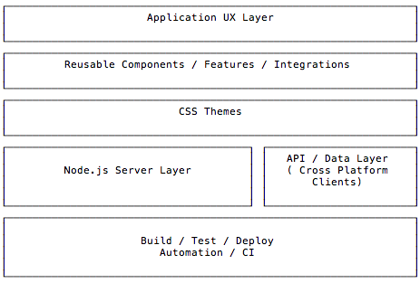
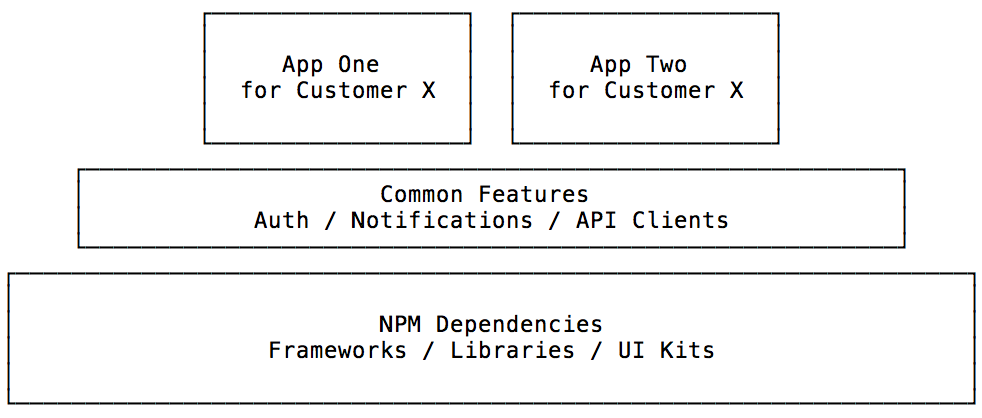

# Skypager
> Universal, Fully Integrated, Cross Platform JavaScript Container 

[](https://circleci.com/gh/skypager/skypager/master) [](https://ci.appveyor.com/project/soederpop/skypager/branch/master)


Skypager provides you with a batteries included CLI for creating, building, running, and deploying cross platform JavaScript applications for node.js and the browser.  

It makes publishing or downloading reusable components as modules, either from npm or multiple CDNs, as simple as one command.

In addition, Skypager provides a framework for developing reusable application runtime modules that can package different features and capabilities, and especially third party dependencies, in a highly cacheable way.

The goal is to enable you to be able build to light weight applications that only contain what is unique about them, on top of a runtime modules that you can maintain or download from NPM that act as a sort of reusable framework. 

These light weight applications will only deliver what is unique about them to the end user, and rely on shared caches for common code.

As a developer, you'll benefit from easily being able to manage your boilerplate, and separate it from what makes each project unique. 

As a team of developers, Skypager's module boundaries, based on where code is stored, makes it easier to solve problems once and reuse that solution in multiple projects any time you are ready to release a new version. 

Projects which use the Skypager framework only need to have access to the modules, and can be installed globally or as a project dependency.  

## What makes it different?

Skypager is not like a traditional JavaScript framework, instead it gives JavaScript developers the pieces we need to build our own own frameworks on top of the "many different modules" we use (from repositories like NPM, and our own). 

Skypager is designed for people who want to build their own portfolios, or monorepos, consisting of their own modules, while leveraging all of the solutions to problems that have already been solved by other people and published to NPM.  If you have a handful of apps, all which use the same "stack" of third party libraries, and you want the ability to standardize all of these apps and make it easier to share the progress you make on one app with all of the other apps, Skypager is for you.

Skypager enables you to develop the different layers of your portfolio separately from one another, so that the components and modules which rarely change are built once, cached, and re-used until they change again.  The pieces of the app which change more often, are developed in a separate layer.  This is especially ideal for projects which multiple people or multiple teams contribute to, as the different layers that naturally emerge are very inline with the different teams and skillsets which contribute to a modern application.



In the graphic above, each box might represent a completely different department in a product organization.  

If you're a solo full stack developer, each box represents a separate concern that you need to address using whichever hat you're wearing at the time.  You might be in charge of everything, but use off the shelf themes from bootstrap or semantic ui, or your client may be providing these visual elements for you.  You should be able to easily incorporate, or swap out any element, without causing too much stress on all of the other parts.

In other words, if you don't already manage these aspects of an application as their own independent layer, you are probably having a much harder time than you need to be when changing things in the different layers.

## Installation

You can install the single package `skypager` which provides the latest versions from the '@skypager/*' portfolio

```shell
$ yarn add skypager --save 
```

Or you can install the inividual packages directly:

```shell
$ yarn add @skypager/cli @skypager/node --dev # for single page apps and not servers, these can be devDependencies
$ yarn add @skypager/web --save # for the browser builds, this is a runtime / production dependency
```

If you wish to take advantage of webpack `build` `start` and `watch` scripts, modeled after [Create React App](https://github.com/facebook/create-react-app), you can install `@skypager/webpack`

```shell
$ yarn add @skypager/webpack --dev
```

If you wish to use MDX, and the [Skypager Document Helper](src/helpers/document) to be able to build cool things using your project's Markdown and JavaScript modules as a database

```shell
$ yarn add @skypager/helpers-document --save
```

## CLI

Installing `@skypager/cli` will provide an executable `skypager`.

If you pass either the `--esm` or `--babel` flags, it will enable ES module support in any of the modules your script requires.

If you pass the `--debug` flag to any `skypager` command, it will enable the node debugger.

The `skypager` CLI is a node.js script runner that provides the above conveniences when running any script, but it also is designed to makes it easier to share re-usable script commands across an entire portfolio of JavaScript projects.  

By this I mean, for any `skypager $command`

- It will scan your current project for scripts to run, 
- it will scan your monorepo or scoped packages if your project name includes a `@scope` prefix 
- it will run any scripts provided by `@skypager/*` modules.  

Any time any of these scripts uses the `@skypager/runtime` module (or `@skypager/node` or `@skypager/react`) these runtime instances will run in the context of the nearest `package.json` file.

- `skypager.cwd` will point to the directory of the nearest `package.json`
- `skypager.gitInfo.root` will point to the directory of the nearest `.git` folder

This behavior makes it so that the current `package.json` represents the current project.  

And the `runtime` object you import can be used to tell you info about this specific project. 

If that project has a `skypager.js` file, that file will automatically be loaded and can be used to customize the node.js runtime for that project.

This behavior allows you to write scripts which adapt to the current project they are in.

This means much less copy and pasting and duplication of code, because you can write scripts and servers which are flexible and rely on the current `package.json`, or on other files following a similar file name conventions.

**How it works:**

When you run 

```shell
$ skypager whatever
```

the CLI will search in the current project folder for `scripts/whatever.js` and run that.

if there is no such file, it will search your package scope.  so for example, if your current `package.json` has a scoped package name `@myscope/my-package`, then it will 
attempt to search every package in your node_modules that starts with `@myscope/`, and for each one that meets the following criteria, possibly run the script: 

- 1) has a `scripts/whatever.js` file 
- 2) has a `myscope.providesScripts` property in the package.json which includes `"whatever"`

  ```javascript
  {
    "name": "@myscope/my-reusable-helper",
    "myscope": {
      "providesScripts": [
        "whatever"
      ]
    }
  }
  ```

if there is no such file in any of your scoped packages, then it will search the `@skypager/*` scope using the same logic.  

Packages like `@skypager/webpack` provide scripts `build`, `start`, and `watch` because it [includes the following scripts](https://github.com/skypager/skypager/tree/master/src/devtools/webpack/scripts).  If this package is installed, it will be added to the search path

if none of the @skypager/* scoped packages has the command, it will search the scripts provided by [@skypager/cli itself](https://github.com/skypager/skypager/tree/master/src/devtools/cli/scripts)

### Skypager CLI Commands

- [console](https://github.com/skypager/skypager/blob/master/src/devtools/cli/scripts/console.js) an enhanced node REPL which auto-resolves promises and loads the skypager node runtime for the current project
- [hash-build](https://github.com/skypager/skypager/blob/master/src/devtools/cli/scripts/hash-build.js) generate a JSON build manifest of all of your build artifacts, their size, hash, timestamps, etc.  calculate a source hash from the current state of your source files.
- [list-all-scripts](https://github.com/skypager/skypager/blob/master/src/devtools/cli/scripts/list-all-scripts.js) provides information about the available scripts that the skypager cli finds in the current project
- [run-all](https://github.com/skypager/skypager/blob/master/src/devtools/cli/scripts/run-all.js) run multiple tasks, including inside of a monorepo, in parallel or sequentially, with various options for managing their output
- [serve](https://github.com/skypager/skypager/blob/master/src/devtools/cli/scripts/serve.js) start a server
- [socket](https://github.com/skypager/skypager/blob/master/src/devtools/cli/scripts/socket.js) spawn a long running runtime process which communicates over a cross-platform domain socket 
- [start-and-test](https://github.com/skypager/skypager/blob/master/src/devtools/cli/scripts/start-and-test.js) a utility for starting one process, and then running another as a test script. will stop the initial process when the test script finishes.

If you've installed [@skypager/webpack](https://github.com/skypager/skypager/tree/master/src/devtools/webpack) you'll get

- [build](https://github.com/skypager/skypager/blob/master/src/devtools/webpack/scripts/build.js) generate a webpack build for the current project.
- [start](https://github.com/skypager/skypager/blob/master/src/devtools/webpack/scripts/start.js) starts a local HMR webpack server for the current project
- [watch](https://github.com/skypager/skypager/blob/master/src/devtools/webpack/scripts/watch.js) run the webpack build compiler in watch mode

If you've installed [@skypager/helpers-document](https://github.com/skypager/skypager/tree/master/src/helpers/document) you'll get

- [generate-api-docs](https://github.com/skypager/skypager/tree/master/src/helpers/document/scripts/generate-api-docs.js) generate markdown from your JSDOC comment blocks 
- [test-code-blocks](https://github.com/skypager/skypager/tree/master/src/helpers/document/scripts/test-code-blocks.js) parses and evaluates your javascript codeblocks in your markdown.  can be used to test your markdown documentation to ensure it is valid.
- [inspect-docs](https://github.com/skypager/skypager/tree/master/src/helpers/document/scripts/inspect-docs.js) provides information about the markdown documents found in the project

Running any of the above commands with the `--help` flag or with the word help, will get you detailed command usage information

example:

```shell
$ skypager socket help
$ skypager socket --help
```

## Usage

**Usage with webpack or other bundlers**

```javascript
// this will be either @skypager/node or @skypager/web depending on your build platform
import runtime from 'skypager'

runtime.start().then(() => {
  console.log('Skypager Runtime Is Started')
})
```

**Usage via script tag**

```html
<script type="text/javascript" src="https://unpkg.com/@skypager/web"></script>
<script type="text/javascript">
  skypager.start().then(() => {
    console.log('Skypager Runtime is Ready')
  })
</script>
```

## Designed to be Extendable

The `runtime`, while useful by itelf, is designed to be extended.  

When you solve a problem that all of the applications in your portfolio can benefit from, you can solve it in a separate module and create a runtime which automatically has access to this module and can lazy load it when needed.

```javascript
import runtime from '@skypager/runtime'
import MyNotificationsFeature from '@my/features-notifications'
import MyLoggingFeature from '@my/features-logging'
import MyAnalyticsFeature from '@my/features-analytics'
import MyUserAuthenticationFeature from '@my/features-authentication'

const myRuntime = runtime
  .use(MyUserAuthenticationFeature)
  .use(MyNotificationsFeature)
  .use(MyLoggingFeature)
  .use(MyAnalyticsFeature)

export default myRuntime 
```

With this module, you have encoded a standard base layer that all of your apps can share.  These apps should never need to solve authentication, notifications, logging, or analytics on their own.  They get the benefit of these features just by using your runtime.

In any application

```javascript
import React from 'react'
import { render } from 'react-dom'
import runtime from 'myRuntime'

const App = ({ runtime }) =>
  <pre>{JSON.stringify(runtime.currentState, null, 2 ) }</pre>

runtime.start()
.then(() => render(<App runtime={runtime} />, document.getElementById('app')) )
```

### Extensions API 

Extending the runtime with another module, relies on the following API

Your extension module can:

- **export an attach function** to run synchronously

```javascript
export function attach(runtime) {
  // runtime is the instance of the runtime that is using the extension
}
```

this style allows for extensions to take effect right away.

- **export a function** to run asynchronously

```javascript
export default function initializer(next) {
  const runtime = this
  Promise.resolve().then(() => next())  
}
```

this style allows for extensions to take effect whenever `runtime.start()` is called.

Using an extension is possible with:

```javascript
import runtime from '@skypager/runtime'
import asyncInitializer from './async-initializer'
import * as syncAttach from './sync-attach'

runtime
  .use(syncAttach)
  .use((next) => asyncInitializer(next))
```

The code that was part of the `attach` function above ran immediately.

the code that war part of `asyncInitializer` above won't run until later on in my script, when I call

```javascript
async function main() {
  await runtime.start()
}

main()
```

This extension API gives you full control, in your application, or in reusable components, for when code and dependencies can be loaded and how they are to be configured.  

### Lazy Loading Example

For example, with the extension API it is possible to package up modules which lazy load other modules on demand. 

```javascript
import runtime from '@skypager/web'

function loadAtRuntime(next) {
  const runtime = this

  // runtime.currentState will equal whatever window.__INITIAL_STATE__ is set to.  This can be injected by
  // whatever is outputing your HTML.  (Webpack / Express, etc.)
  const settings = runtime.currentState.settings

  // loads the requested feature from unpkg, assumes the global variable name each module exports follows the library package name convention
  const feature = (name, options = {}) => {
    const { version = 'latest' } = options
    const { upperFirst, camelCase } = runtime.stringUtils
    const globalVar = upperFirst(camelCase(name.replace('@', '').replace('/', '-'))) 

    return runtime.assetLoaders
      .unpkg({ [globalVar]: `${name}@${version}` })
        .then(results => {
          const extension = results[globalVar]
          runtime.use(extension)
        })
  }

  return Promise.all([
    feature('@skypager/integrations-firebase', {
      config: settings.firebase 
    }),
    feature('@skypager/integrations-npm', {
      config: {
        npmToken: settings.npmToken
      }
    }),
    feature('@skypager/integrations-github', {
      config: {
        token: settings.githubToken
      }
    })
  ])
}

export default runtime.use(loadAtRuntime)
```

In the above example, I've packaged up a runtime that comes complete with a firebase integration, a github and npm integration.

All of the code needed to power these integrations is bundled with the runtime, and is lazy loaded when needed from unpkg.  

This reusable module expects that it will be dynamically configured at runtime via `settings` that is pulled from the runtime's state.

The runtime's state is data that can easily be controlled to be project specific, deployment specific, or dynamically controlled based on node's `process.env` or `process.argv` variables. (If you're deploying the same project to multiple URLs for example.)

The extension itself just passes this data as arguments when enabling each feature.

## Beyond Boilerplates 

The idea of using boilerplate projects, or even most recently, Github template repositories, is appealing because github repositories are free and unlimited and disk space is cheap.  Duplicating npm dependencies, and boilerplate code for wiring up React with
React Router, and with express and server side redering, is a manageable side effect as you begin to accumulate projects and repositories.

Instead, when developing using a monorepo, or portfolio, the boilerplate is managed by conventions for project types and module exports (what we define in the `main` or `browser` `module` `style` or `unpkg` properties in our package.json )

So it is possible to abstract things which provide build scripts in and say

modules which provide build scripts are named `@myscope/build-scripts-*`

modules which provide features are named `@myscope/features-*` 

modules which provide servers are named `@myscope/servers-*` 

In a monorepo, there can be multiple providers of `build-scripts`, `servers` and `features`.  

Which one a particular project relies on, is better left to be determined by incorporating that specific project's `package.json` and combining it with `process.argv` or `process.env`. 

Skypager makes this just in time module composition a first class citizen in your projects.

## What does the runtime provide your application?

- See the [API DOCS](src/runtime/docs/api)
- Asynchronous middlewares and lifecycle hooks (tap into any stage of the application boot and initialization logic)
- Environment detection (isBrowser, isNode, isReactNative, isElectron, isElectronRenderer, isProduction, isDevelopment, isTest, isCI, etc)
- Event emitters and global event bus patterns
- [A 12 factor application architecture pattern](docs/12-factor-architecture.md) that makes it easy to containerize your frontend code and inject environment or deployment specific configuration in from the outside, so that your applications are portable and vendor agnostic.
- A really good balance between composition and inheritance.  Inspired by React and Docker.
- Out of the box integration between design / build / test / runtime contexts ( even in production! ) 
- Utilities for working with strings, urls, routes
- [A module registry system](docs/module-registries.md) that can load any kind of module in any environment (even dynamically at runtime in the browser from npm) 
- [Utilities for dynamically building interfaces and mixins](docs/property-utils.md) (turn any simple JSON object you have access to into an [Entity](docs/entity-model.md) 
- Dependency injection API

### Familiar Component Module (State, Props, Context) 

Componetize any Runtime, and Componetize any module in the Runtime with a `Helper` class that is very similar conceptually to a React Component.  Each Helper subclass can be used to `mount` any module and provide it with observable state and life-cycle hooks.

- The `Helper` is a `React.Component`, the instances are the mounted elements.  
- The module (a helper's `provider`) provides `defaultProps` 
- The options you pass when you create a `Helper` instance are the actual props
- The Rutime can pass context down to Helper instances which can pass their own context down to other Helpers they create. 
- Each module instance has a observable `state`

### Observable / State API

The Runtime uses the Mobx library as its reactive state engine to provide applications with observable objects.  It uses it internally, and exposes it as a dependency that can be injected into your app if you don't want to bundle Mobx separately.

The Runtime has a `state` observable, and a React like `setState` API

Helper subclasses can provide their own observable state as well, and really any mobx primitive

## Motivation

In 2019, JavaScript has become a universal language that empowers people to deploy applications on every platform, device, or form factor you can imagine.  There is an open source package for almost any thing you could need help building.  We can write code once in the most modern form of the language, and transpile code to support the oldest browsers out there.  This is a somewhat recent development in JavaScript, but it eliminates any tradeoffs we once had to make when choosing how we write JavaScript, given that it might be run on older browsers which don't support our features. 

All of these capabilities come with a cost in complexity, and can become barriers that prevent people from being able to contribute to a project.  Many tools have emerged to address this problem in the time I have spent developing Skypager: tools which aim to provide developers with a single dependency solution offering zero config developer experiences.  Skypager also provides a similar tool, however I think that zero config single dependency tools address this problem from a very limited perspective since once build tooling is standardized, there is still an entire universe of other things which multiple projects have in common, and not only is it tedious to keep repeating them, it makes software development much more expensive than it needs to be, and forces us to spend more time on things which our users don't really care about. With JavaScript we have very little in the way of standardizing and re-using these patterns.  At best they live in a coding standards document and are taught to every developer who joins the project.

Skypager is my attempt to codify and modularize all of the things I've seen my applications have in common in the 20 years I have been developing JavaScript applications.

## Runtime Concept

Regardless of which framework you are using, if you're using a single page app, or rendering pages on the server, you're probably using some routing DSL (like Express, Hapi, or React-Router, or many others) to declare which URLs map to which pages.  Even if you're building a completely static website, your folder organization is itself a routing DSL.

If you have multiple apps which use the same libraries, chances are most of the project's source trees are very similar to each other.  The code which is different in each app, odds are, can be understood quickest by looking at the routes and seeing which modules are used to render them in response to a user's request.  (If you've used Webpack or any other module bundler, these are your "entry" points.)

Each of the pages in your app, should generally not know or care about how they were rendered.  This is especially true when you want to render a page first on the server, and then let client side JS handle the rest, without changing the code.  

The `runtime` idea exists to provide the code in this top level UX layer with a single object to talk to which behaves the same way regardless of which environment you're running.  It takes care of abstracting the many differences away, so your code can focus on what makes it unique for your user.

Skypager provides a few base runtimes:

- [@skypager/runtime](src/runtime) - universal platform agnostic base runtime, which provides observable state, and other utilities which are useful in any context
- [@skypager/node](src/runtimes/node) - the universal runtime extended with node specific features and helpers, used in server side scripts / long running processes (e.g. web or api servers)
- [@skypager/web](src/runtimes/web) - the browser runtime extended with browser specific features and helpers, used in your browser builds

And the following runtimes are being ported over from older versions of skypager

- [@skypager/electron](ROADMAP.md) - either the node or web runtime, extended with electron specific libraries and utilities depending if you're in the renderer or main electron process
- [@skypager/native](ROADMAP.md) - the universal runtime extended with react-native specific features 

The value of this approach means when you're developing React Components, you can have them talk to the runtime instead of the platform.  When you want to re-use this component in another platform or process, it should be no big deal to do so.

Similarly, when you want to reuse these components across different apps which also use the `runtime`, you don't need to make so many changes as your apps will have a uniform pattern for how they get their state.

## Docker for the Frontend

I think of Skypager as being the equivalent of Docker for JavaScript applications running in the browser, on the server, on phones, desktops, in space.  It provides you with a system for working with JavaScript modules in cacheable layers, just like Docker.  This makes it possible to separate your work into layers, where the things which change the least, but are most foundational, are at the bottom.  The things which change the most, and are at the top.



Using this approach makes releasing cross platform JavaScript much easier, because your top level application layer is abstracted away from the underlying platform layer.  These underlying platform layers are aware of this, and perform dependency injection

### Layers are just collections of modules 

A Layer is just a group of dependencies that work together.  Skypager provides a [Helper Base Class](docs/about-helpers.md) for standardizing different types of modules based on when and where in the application process they are used:

- [The Rest Client Helper](src/helpers/client) - a wrapper around the axios REST client.  As a developer you can write a friendly, cross-platform interface for making calls with axios.
- [The Server Helper](src/helpers/server) - a wrapper around any server that can be started and stopped.  By default provides an express server with history api fallback and static file serving enabled.
- [The Feature Helper](src/runtime/helpers/feature.js) - a module that provides an interface to specific functionality on the running platform. Can be `enable()d` or `disable()d`
- [The Google Sheets Helper](src/helpers/google-sheet) - a module that loads data as JSON from a google spreadsheet.  As a developer you can write an interface for reading, transforming, or updating this data.
- [The Google Documents Helper](src/helpers/google-doc) - a module that loads data as JSON from a google document.  It loads all of your content, and document stylesheets, in an traversable AST form.
- [The Sketch Document Helper](src/helpers/sketch) - a module that lets you load a designers sketch files as javascript modules.  This can be used to power various code generation apps, as well as anything else you can think of.
- [The Document Helper](src/helpers/document) - provides helpers for loading markdown and javascript source modules as queryable entities, useful for automated codemods, code generation, documentation websites, and building databases from markdown or javascript module collections

The Runtime is responsible for activating each of these layers for you, relying on [The Inversion of Control Technique](docs/inversion-of-control-framework.md) for your modules.  (aka Don't call me, I'll call you.)

## Example Projects

Skypager is a powerful framework which can be used to build any kind of app, here are some examples.

- [Sheets Server](src/examples/sheets-server) A REST API that lets you browse your google spreadsheets, and request them in JSON form
- [Conceptual Example](docs/conceptual-example.md)

## Local Development

In order to develop and test this project locally, you will need a service account json for a google cloud project.  It should have the google drive and sheets api's enabled.

In order to run the tests, This file's content needs to either be stored in an environment variable `SERVICE_ACCOUNT_DATA` or you will need to copy this file to

- src/helpers/google-sheet/secrets/serviceAccount.json
- src/examples/sheets-server/secrets/serviceAccount.json

See our [Circle CI Config](.circleci/config.yml) for an example of how I set up a project in CI to run tests.
