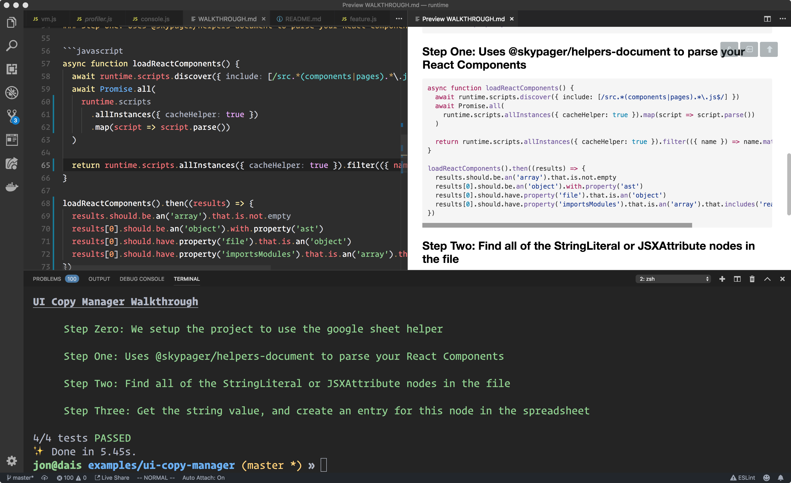

# Runnable MDX Example

This project contains an example web application which uses the [@skypager/helpers-document](../../helpers/document) to build a database of documents,
and then display it as a website.  We use the [Runnable](../../helpers/document/src/components/Runnable.js) or [Renderable](../../helpers/document/src/components/Renderable.js) components
to render our markdown code blocks as special components that use [Ace Editor](#) to let the user edit the code block, and get immediate feedback
when the code changes in the form of component examples or REPL like output with the results of each line.  

> TODO: Include Visual Example 

You can launch the demo using the following

```shell
$ yarn demo
```

## Testable Markdown

Running the following command will give you just one potential application of having markdown documents which can run their code blocks. 

```shell
$ skypager test-code-blocks README.md
```



## Runnable MDX Code Blocks

As of MDX.js 1.0, we can pass additional props to our components for code blocks

```markdown
This code block will be editable, and runnable:

~~~javascript runnable=true
const sum = 1 + 1
console.log('YO YO', sum)
~~~
```

This will result in `<Editor value="const sum = 1 + 1\nconsole.log('YO YO', sum)" runnable mode="javascript" />`

## Highlights

We can discover all of the mdx files in our project, process them, and make them runnable

```javascript
const runtime = require('@skypager/node').use(require('@skypager/helpers-document'))

async function createRunnableDocs() {
  await runtime.mdxDocs.discover()
  const docs = runtime.mdxDocs.allInstances({ cacheHelper: true })

  return Promise.all(
    docs.map((doc) => doc.process()).then(() => doc.toRunnable())
  )

  return docs
}
```

### Convert Markdown blocks to a JavaScript Module

Once we have a runnable markdown document, we can convert it to a JavaScript module.

The module exports will consist of functions named after the parent headings the code block belong to. 

```javascript
const runnable = runtime.mdxDoc('README', { cacheHelper: true })

async function useRunnable() {
  await runnable.process()
  const runnableModule = await runnable.toExport()

  return runnableModule
}

useRunnable().then((mod) => {
  mod.should.have.property('highlights').that.is.a('function')
})
```

## How does it work

We can use the MDX AST to extract the language nouns and attributes are used in the writing.

When we're writing about software, we can take advantage of the importance of nouns and names as they usually refer to the things we're working on in our code.

We assume things about each noun based on the heading it belongs to.  For example, the list items under the `## Sitemap` heading contain links.  

We assume the text of the link is the name of the page, and the href of the link is the URL that page is served on.

We assume links to certain types of files can be parsed and followed, and even understood by other Skypager Helpers.  (Google Sheets, Google Docs, Sketch Files, can all be turned into objects with APIs.) 

The [SITE-TEMPLATE.md](SITE-TEMPLATE.md) file is a Markdown document with YAML frontmatter. 

```markdown
---
projectType: react-web-application
customer: Soederpop, Inc
deployTo: zeit
accounts:
  google: soederpops-google
---

# [My Website](https://soederpop.com)

[Sketchfile Link](https://link.to/designer/)
[Mock Data](https://google-sheets.com/my/spreadsheets/my-website/mock-data)
[Page Copy](https://google-docs/my/documents/my-website/content)

## Sitemap 

- [Home](/)
- [About](/about) 
- [Contact US](/contact-us) 
- [Products](/products)
- [Product Details](/products/:id)
```

The [Document Helper](../../helpers/document) uses [MDX](../../helpers/mdx) to turn this content it into the following:

```javascript
async function main() {
  await runtime.mdxDocs.discover()
  const siteTemplate = runtime.mdxDoc('SITE-TEMPLATE') 

  const { meta, ast, headingsMap, Component } = siteTemplate
}
```

**headingsMap**

```json
{
  "headings": {
    "My Website": 1,
    "Sitemap": 7
  },
  "lines": {
    "1": "My Website",
    "7": "Sitemap"
  }
}
```

**Metadata**

```json
{
  projectType: "react-web-application",
  "customer": "Soederpop, Inc",
  "deplyTo": "zeit",
  "accounts": {
    "google": "soederpops-google"
  }
}
```

**AST**

```json
{
  "type": "root",
  "children": [
    {
      "type": "heading",
      "depth": 1,
      "children": [
        {
          "type": "link",
          "title": null,
          "url": "https://soederpop.com",
          "children": [
            {
              "type": "text",
              "value": "My Website"
            }
          ]
        }
      ],
      "position": {
        "start": {
          "line": 2,
          "column": 1,
          "offset": 1
        },
        "end": {
          "line": 2,
          "column": 38,
          "offset": 38
        }
      }
    },
    {
      "type": "paragraph",
      "children": [
        {
          "type": "link",
          "title": null,
          "url": "https://link.to/designer/",
          "children": [
            {
              "type": "text",
              "value": "Sketchfile Link"
            }
          ]
        },
        {
          "type": "text",
          "value": "\n"
        },
        {
          "type": "link",
          "title": null,
          "url": "https://google-sheets.com/my/spreadsheets/my-website/mock-data",
          "children": [
            {
              "type": "text",
              "value": "Mock Data"
            }
          ]
        },
        {
          "type": "text",
          "value": "\n"
        },
        {
          "type": "link",
          "title": null,
          "url": "https://google-docs/my/documents/my-website/content",
          "children": [
            {
              "type": "text",
              "value": "Page Copy"
            }
          ]
        }
      ],
      "position": {
        "start": {
          "line": 4,
          "column": 1,
          "offset": 40
        },
        "end": {
          "line": 6,
          "column": 65,
          "offset": 225
        }
      }
    },
    {
      "type": "heading",
      "depth": 2,
      "children": [
        {
          "type": "text",
          "value": "Sitemap"
        }
      ],
      "position": {
        "start": {
          "line": 8,
          "column": 1,
          "offset": 227
        },
        "end": {
          "line": 8,
          "column": 12,
          "offset": 238
        }
      }
    },
    {
      "type": "list",
      "ordered": false,
      "start": null,
      "loose": false,
      "children": [
        {
          "type": "listItem",
          "loose": false,
          "checked": null,
          "children": [
            {
              "type": "paragraph",
              "children": [
                {
                  "type": "link",
                  "title": null,
                  "url": "/",
                  "children": [
                    {
                      "type": "text",
                      "value": "Home"
                    }
                  ]
                }
              ]
            }
          ]
        },
        {
          "type": "listItem",
          "loose": false,
          "checked": null,
          "children": [
            {
              "type": "paragraph",
              "children": [
                {
                  "type": "link",
                  "title": null,
                  "url": "/about",
                  "children": [
                    {
                      "type": "text",
                      "value": "About"
                    }
                  ]
                },
                {
                  "type": "text",
                  "value": " "
                }
              ]
            }
          ]
        },
        {
          "type": "listItem",
          "loose": false,
          "checked": null,
          "children": [
            {
              "type": "paragraph",
              "children": [
                {
                  "type": "link",
                  "title": null,
                  "url": "/contact-us",
                  "children": [
                    {
                      "type": "text",
                      "value": "Contact US"
                    }
                  ]
                },
                {
                  "type": "text",
                  "value": " "
                }
              ]
            }
          ]
        },
        {
          "type": "listItem",
          "loose": false,
          "checked": null,
          "children": [
            {
              "type": "paragraph",
              "children": [
                {
                  "type": "link",
                  "title": null,
                  "url": "/products",
                  "children": [
                    {
                      "type": "text",
                      "value": "Products"
                    }
                  ]
                }
              ]
            }
          ]
        },
        {
          "type": "listItem",
          "loose": false,
          "checked": null,
          "children": [
            {
              "type": "paragraph",
              "children": [
                {
                  "type": "link",
                  "title": null,
                  "url": "/products/:id",
                  "children": [
                    {
                      "type": "text",
                      "value": "Product Details"
                    }
                  ]
                }
              ]
            }
          ]
        }
      ],
      "position": {
        "start": {
          "line": 10,
          "column": 1,
          "offset": 240
        },
        "end": {
          "line": 14,
          "column": 35,
          "offset": 358
        }
      }
    }
  ]
}
```

You can use all of this information to run scripts which run on behalf of, or in the context of, this document. 

We can hook these scripts up to React Components.  Combined with MDX, this turns markdown into living documents with user interfaces.
